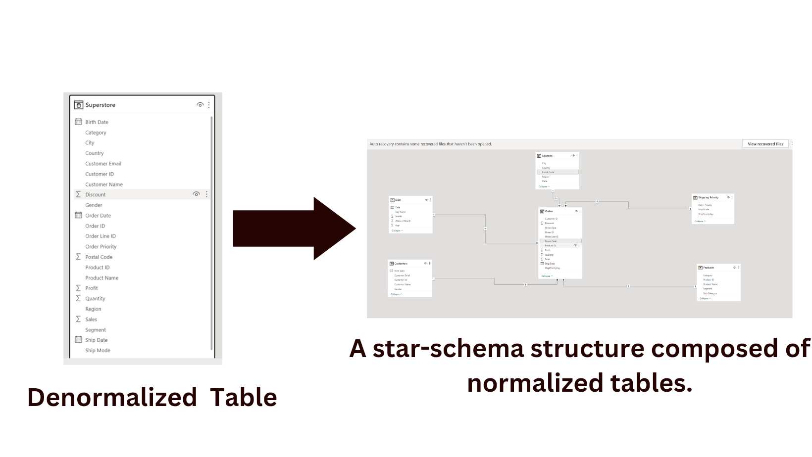
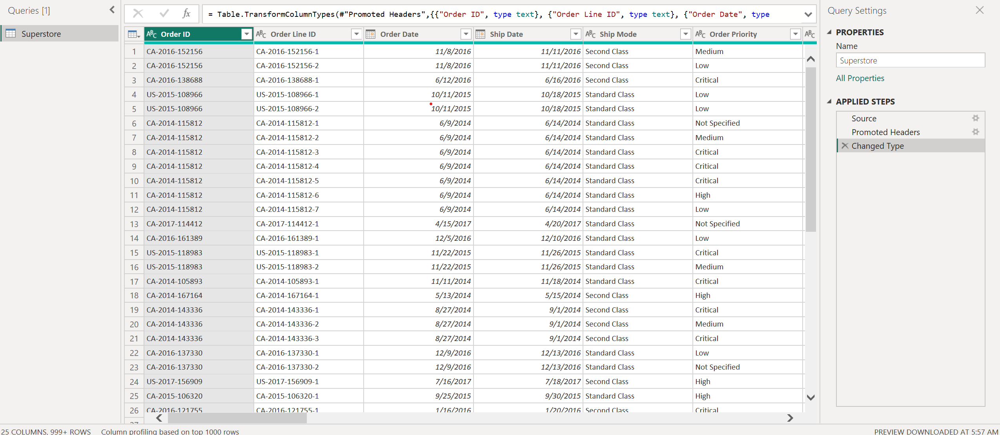
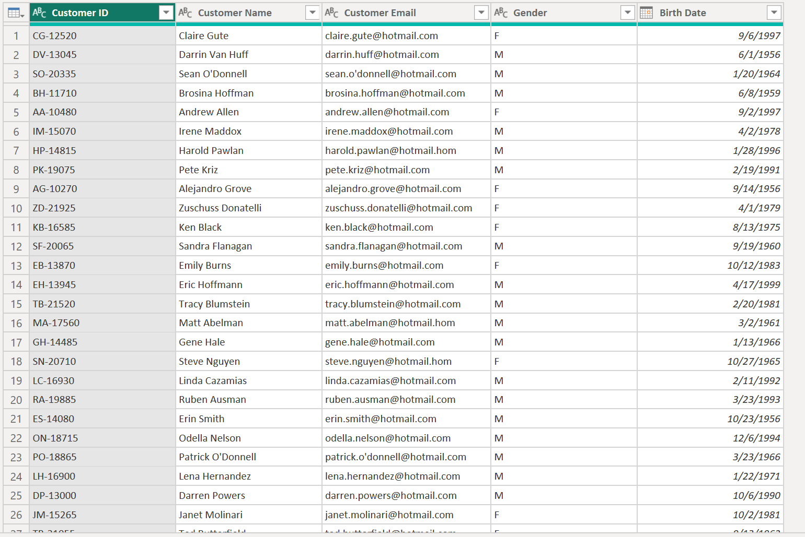
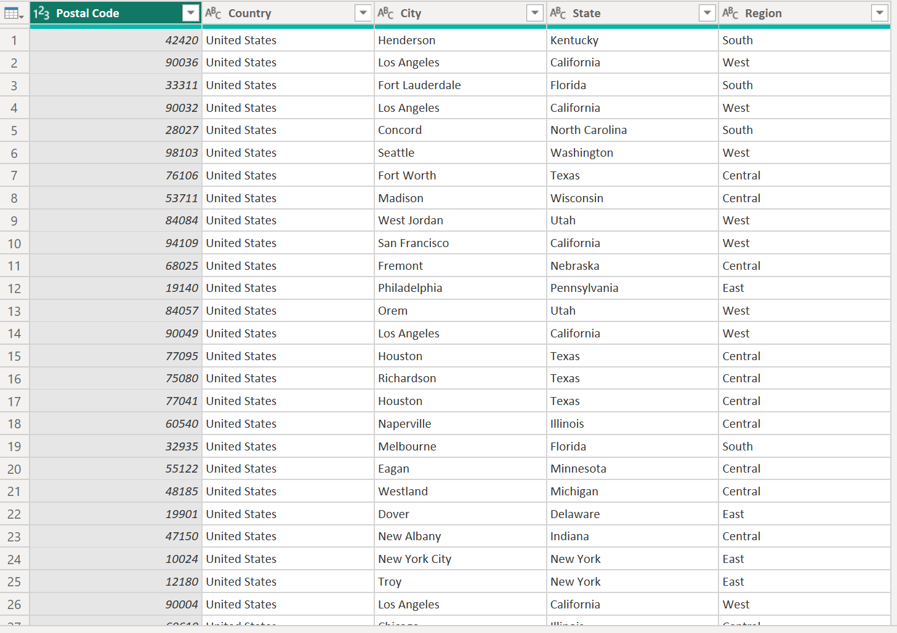
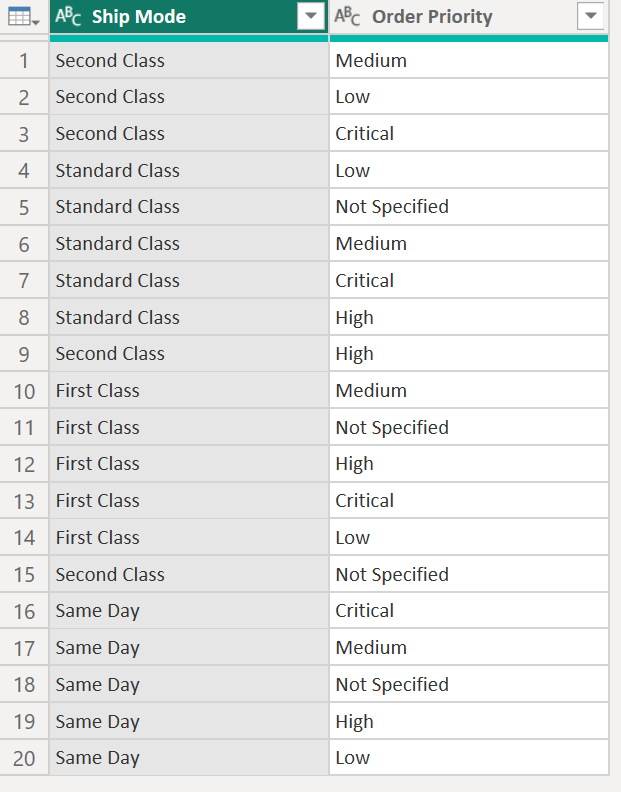
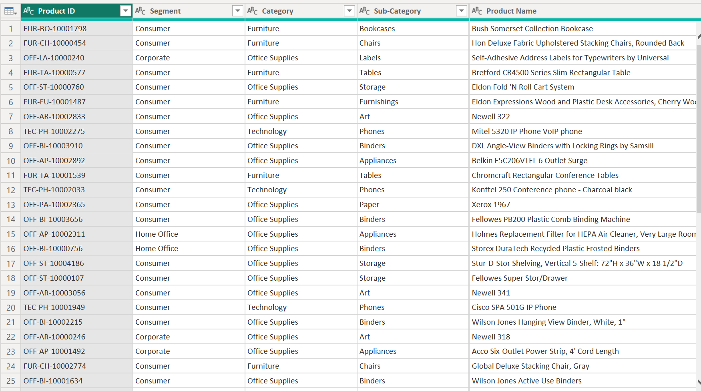
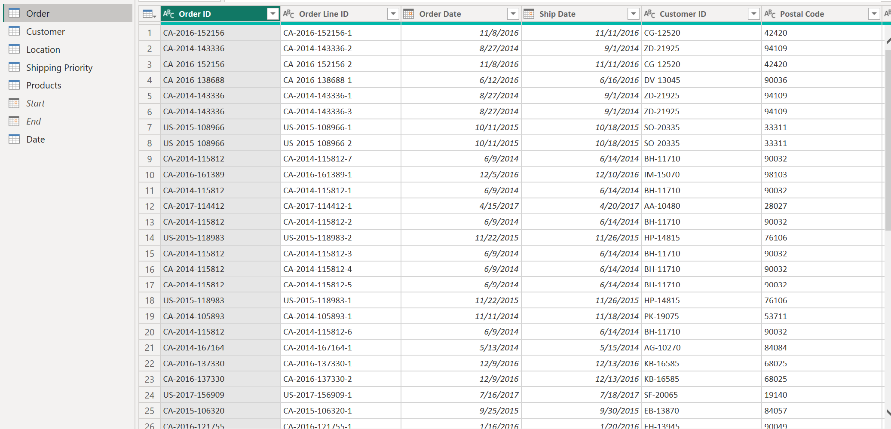
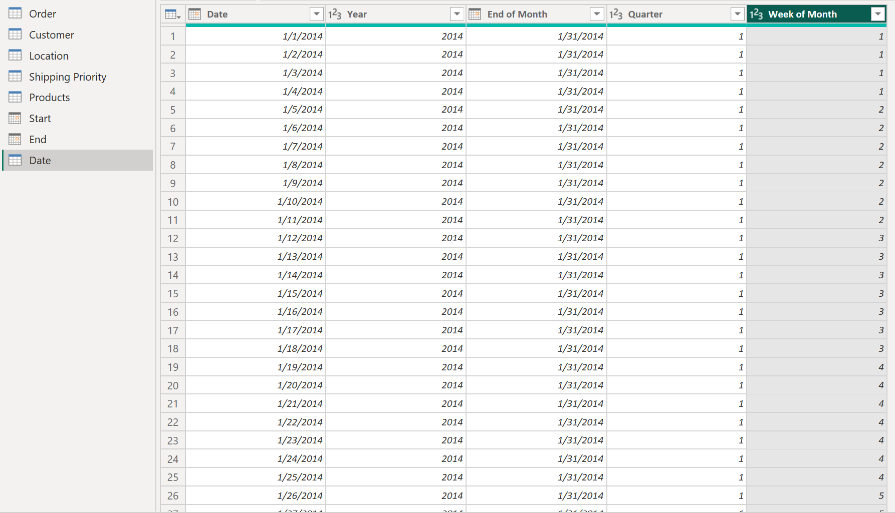
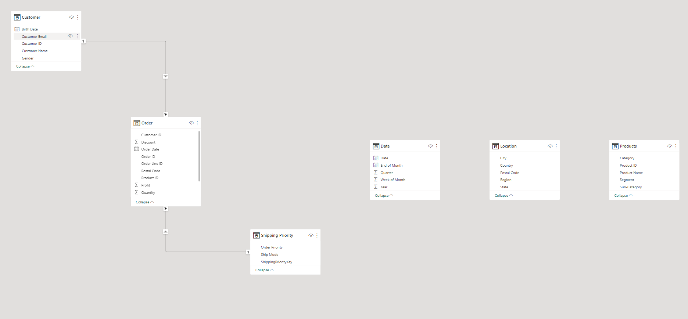
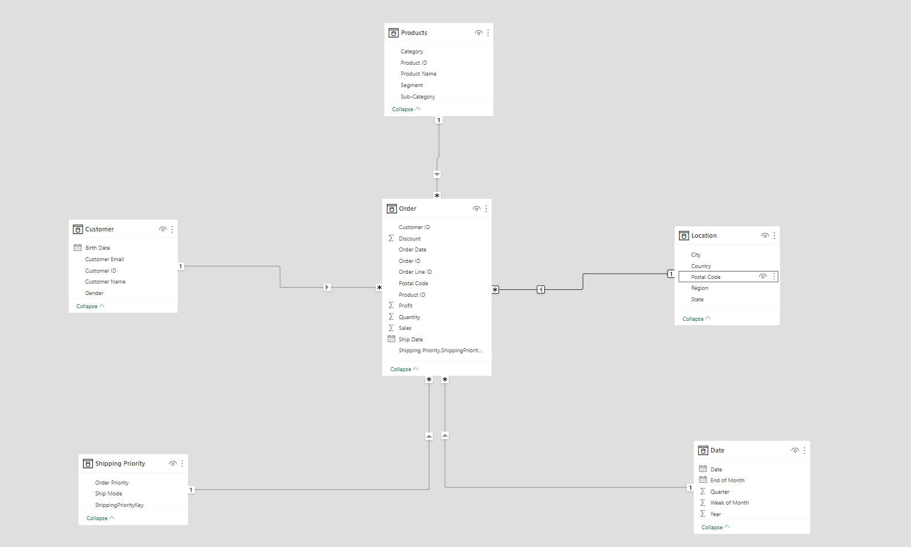

# Unveiling Hidden Patterns with Power BI Data Modeling


__________
In this report, I will outline the steps I took to transform a denormalized data table to a normalized data table using Power BI and also establish a star schema data model between the normalized table.

## About the Data

---

The dataset, acquired from *[Wisabi Analytics](https://drive.google.com/file/d/1_YTWbuxmu3XqeyQCmYxn8yxzDhVHfme6/view)*, is a fictitious representation of Super Store, a prominent multinational retail chain renowned for its diverse product offerings, including Furniture, Technological equipment, and Office supplies. As an invaluable resource for analysis and research purposes, this dataset provides a comprehensive snapshot of the store's operational and sales activities, empowering analysts and researchers to extract valuable insights and make informed decisions.

## Specific Data Problem

---

The dataset at hand comprises a denormalized table housing a multitude of crucial information related to the Super Store, including sales transactions, customer details, product information, and various associated attributes. However, this consolidated table poses significant challenges in terms of maintaining data consistency, mitigating update anomalies, and optimizing the efficiency of complex queries. 

In addition to addressing these issues, my assigned task also entails the creation of a star-based schema for the resulting normalized table, which will enhance data analysis capabilities and streamline reporting processes.

## Data Import

---

To start, I imported the demoralized data table into Power BI. This table had multiple columns with repeated data, which made analysis difficult.

## Data Transformation

---

After importing the data, I used **Power Query** to transform it. Upon reviewing the data, I discovered that the denormalized table contains duplicates and non-uniform attributes.

Below is a screenshot of the table in Power Query.




Here is an overview of the data transformation processes:

- I analyzed the denormalized table and identified the functional dependencies between attributes. Functional dependencies describe relationships between attributes, such as whether one attribute can uniquely identify another. Through this process, I observed 4 functional dependencies that describe the Customers, Products, Location, Dates, Shipping Priority, and Orders of the Super Store.

To account for each unique set of attributes above, I duplicated the original table and renamed each duplicate accordingly.

- I identified the primary keys for each table. The primary key is a unique identifier for each row in the table. Then, I determined the attributes associated with each primary key for their respective tables. I removed attributes that are not related to the functional dependencies of the table. Finally, to avoid data redundancy, I removed duplicate data from the tables. I applied this method for the `Customer`, `Location`, `Shipping Priority`, and `Products` tables, all of which are dimensional tables that hold descriptive data.

After I applied this here is a  screenshot of each of the tables


Customer Dimensional Table


Location Dimensional Table



Shipping Priority Dimensional Table


Products Dimensional Table


- The `Order` table is the fact table of the data model. It is meant to hold quantitative data and foreign keys of all other tables. Qualitative attributes and other attributes that are not related to the `Order` table have been deleted. Each row of the `Order` table is used to measure the business's performance.

Here is a screenshot of the `Order` table


Order Fact Table


- Unfortunately, the Shipping Priority Table did not have any primary keys. To remedy this, I added a new column named "ShippingPriorityKey" and indexed each row of the table starting from 1. I merged the `Order` Table with the Shipping Priority Table using a Left Outer Join. I joined on "Ship Mode" and "Order Priority" to return the ShippingPriorityKey as a foreign key on the `Order` Table.
- I created a `Date` Table using the following steps:
1. I created a blank query and inputted the following code to return the minimum start "Order Date" value on the `Order` table. I then renamed the query as "Start".

    ```markdown
    = Date.StartOfYear(List.Min(#"Order"[Order Date]))
    ```

2. I created another blank query and inputted the code below to return the maximum end “Ship Date” value on the `Order` Table and I renamed the query as End.
    
    ```markdown
    = Date.EndOfYear(List.Max(#"Order"[Ship Date]))
    ```
    
3. I created a new blank query that creates a list of numbers from the value in the Start query and ends at the value in the End query.
    
    ```markdown
    = {Number.From(#"Start")..Number.From(#"End")}
    ```
    
4. I converted the query into a table and changed the data type from Whole Number to Date. Additionally, I extracted various date formats from the column.

Below is a screenshot of the result of the process:


Date Dimensional Table


- I double-checked the data types of each column and changed the data type of the Postal Code column from Whole Numbers to Text in both the `Location` and `Order` tables.

During the data transformation process, there are a few things I noticed. 

- Understanding the functional dependencies is crucial for identifying the appropriate primary keys and determining which attributes should be included in each table.
- Pay attention to establishing relationships between tables using foreign keys.
- Denormalized tables often contain redundant data, which can lead to data inconsistencies and anomalies. By normalizing the data, you can eliminate redundancy and improve data integrity.

## Data Modeling

---

Once the data tables were normalized, I closed & apply the Power Query editor and took it to the model view to establish a relationship. Power BI automatically formed a relationship between the table. 

Here is a screenshot of the model Power BI automatically generated for the tables


Automatically Generated Power BI Model


I deleted the relationship and I established relationships between the different tables using Power BI's built-in tools. This allowed me to easily analyze the data and generate insights. And here is the screenshot of the new star schema model I created:


Star Schema Model


Overall, Power BI proved to be an invaluable tool in the process of creating a normalized data table from a demoralized one. The steps outlined above can be used as a guide for anyone looking to create a similar data model using Power BI.

## Conclusion
---
In this report, the process of transforming a denormalized data table into a normalized one using Power BI and establishing a star schema data model was outlined. The dataset from Wisabi Analytics provided insights into Super Store's operational and sales activities. Challenges related to data consistency and query efficiency were addressed through data transformation steps, including identifying functional dependencies, creating duplicate tables, determining primary keys, removing irrelevant attributes, eliminating duplicate data, and establishing relationships. The resulting star schema model in Power BI enabled easier analysis and insightful reporting, highlighting the effectiveness of Power BI in data modeling.
